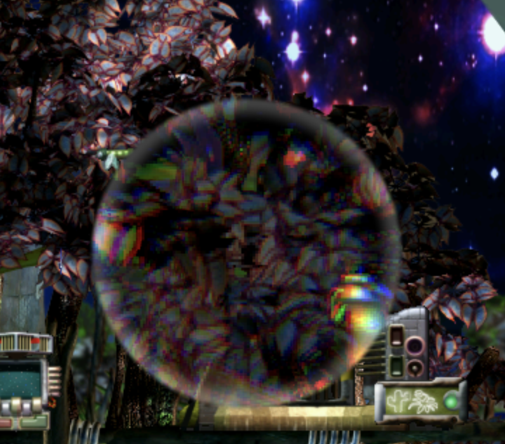

# Magnifier

A glass lens that **magnifies and refracts** the world beneath it, with a chromatic‑dispersion rim. A CESHAD scene‑read shader agent.

- **Classifier:** `2 21 42001`
- **Sprite:** 256×256, scene‑read
- **Shader pack:** `magnifier.ceshad` (source: `magnifier.frag.msl`, meta: `meta.json`)

## Parameters — `shdr "magnifier" { zoom radius refraction dispersion }`

| # | Param | Default | Meaning |
|---|-------|---------|---------|
| 0 | zoom | 2.0 | magnification (>1 magnifies) |
| 1 | radius | 0.42 | lens radius (uv, 0–0.5) |
| 2 | refraction | 0.01 | rim refraction (uv) |
| 3 | dispersion | 0.004 | chromatic dispersion |

## Use

Drop `Magnifier.agent` (spaces removed) into your game's **My Agents** folder and
inject it, or send `install.cos` to the engine's CAOS port. On injection it is
**held by the hand** — click to drop it into the world, click again to pick it up.

## Remove

Send `remove.cos` — it kills every `2 21 42001` agent.
